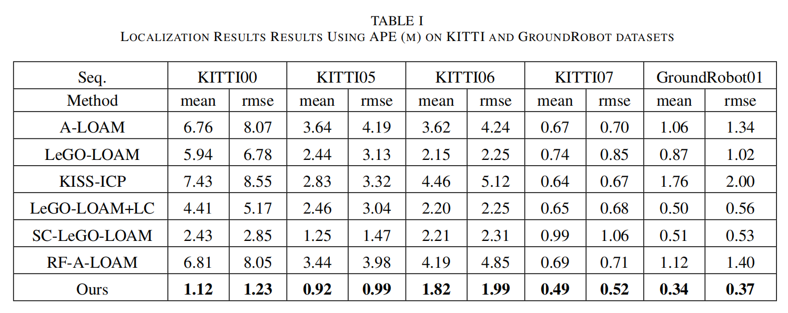
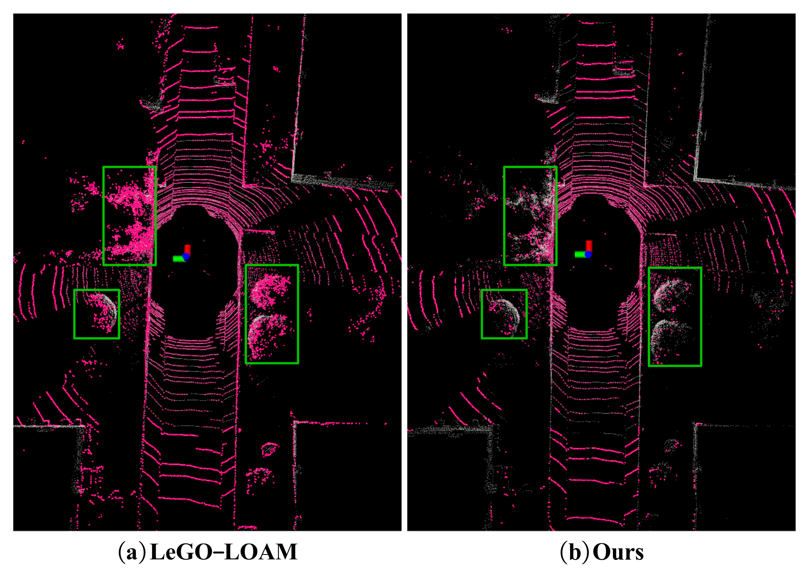

# :dolls: C-LOAM: A Compact LiDAR Odometry and Mapping with Dynamic Removal

The official implementation of C-LOAM (A Compact LiDAR Odometry and Mapping with Dynamic Removal), an accurate LiDAR odometry approach targeted for dynamic environments. C-LOAM achieve dynamic removal, ground extraction, and point cloud segmentation throught range image, showiing its compactedness. Additionally, we use ground points to estimate ground normal to impose ground contraints and feature submap to conduct loop closure detection. This work is accepted by IEEE ICUS 2024.

Welcome to our [website](https://yaepiii.github.io/C-LOAM/) for more details.


If you think our work useful for your research, please cite:

```
@INPROCEEDINGS{10839822,
  author={Zhang, Meifeng and Jia, Yanpeng and Shao, Shiliang and Wang, Shiyi},
  booktitle={2024 IEEE International Conference on Unmanned Systems (ICUS)}, 
  title={A Compact LiDAR Odometry and Mapping with Dynamic Removal}, 
  year={2024},
  volume={},
  number={},
  pages={813-818},
  keywords={Location awareness;Laser radar;Accuracy;Three-dimensional displays;Autonomous systems;Pose estimation;Feature extraction;Real-time systems;Odometry;Vehicle dynamics;Localization;Mapping;SLAM;Field Robots},
  doi={10.1109/ICUS61736.2024.10839822}}

```

## :mega: New

- Oct. 19. 2024: :star: Commit the codes!
- Aug. 20. 2024: :v: Paper is accepted by ICUS 2024!

## :gear: Installation

### Dependence

Our system has been tested extensively on Ubuntu 20.04 Focal with ROS Noetic, although other versions may work. The following configuration with required dependencies has been verified to be compatible:

- Ubuntu 20.04
- ROS Noetic (roscpp, std_msgs, sensor_msgs, geometry_msgs, pcl_ros, jsk_recognition_msgs)
- C++ 14
- CMake >= 3.22.3
- Point Cloud Library >= 1.10.0
- Eigen >= 3.3.7
- Ceres 1.14.0
- GTSAM 4.0.3

If you cannot compile successfully, you can uncomment the line 61 of `CMakeList.txt`, and replace it with your `GTSAM 4.0.3` installation path, such as:

```
set(GTSAM_DIR "/home/jyp/3rdparty/gtsam-4.0.3/build") #4.0.3
```

### Building

You can use the following command to build the project:

```bash
#!/bin/bash
source "/opt/ros/${ROS_DISTRO}/setup.bash"
mkdir -p ~/catkin_ws/src
cd ~/catkin_ws/src
git clone git@github.com:Yaepiii/C-LOAM.git
cd ..
catkin_make
```

## :snail: Run

According to the dataset you want to test, you can modify the parameter values of `pointCloudTopic` in `util.h`. If an IMU is used, modify the parameter values of `imuTopic` in `util.h`.

After sourcing the workspace, launch the C-LOAM ROS nodes via:

```bash
#!/bin/bash
# run C-LOAM node
roslaunch c_loam run.launch

# play your bag
rosbag play your_test.bag --clock
```

## :clipboard: Evaluation

You can modify the pose file save path in line 232 of `mapOptmization.cpp` to save pose estimation results as TUM format, such that:

```
f_save_pose_evo.open("/home/jyp/3D_LiDAR_SLAM/pose_evo.txt", std::fstream::out);
```

### Results







For more results, please refer to our [paper](https://ieeexplore.ieee.org/abstract/document/10839822)

## :rose: Acknowledgements

We thank the authors of the [LeGO-LOAM](https://github.com/RobustFieldAutonomyLab/LeGO-LOAM) and [SC-LeGO-LOAM](https://github.com/gisbi-kim/SC-LeGO-LOAM?tab=readme-ov-file) open-source packages:

- . Shan and B. Englot, "LeGO-LOAM: Lightweight and Ground-Optimized Lidar Odometry and Mapping on Variable Terrain," 2018 IEEE/RSJ International Conference on Intelligent Robots and Systems (IROS), Madrid, Spain, 2018, pp. 4758-4765

- G. Kim and A. Kim, "Scan Context: Egocentric Spatial Descriptor for Place Recognition Within 3D Point Cloud Map," 2018 IEEE/RSJ International Conference on Intelligent Robots and Systems (IROS), Madrid, Spain, 2018, pp. 4802-4809


# Website License
<a rel="license" href="http://creativecommons.org/licenses/by-sa/4.0/"></a><br />This work is licensed under a <a rel="license" href="http://creativecommons.org/licenses/by-sa/4.0/">Creative Commons Attribution-ShareAlike 4.0 International License</a>.
